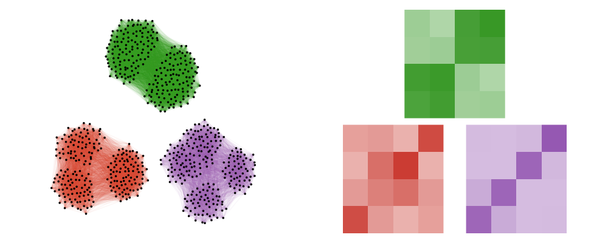

<picture>
  <source media="(prefers-color-scheme: dark)" srcset="./docs/src/assets/logo-dark.png">
  
</picture>

# NetworkHistogram

[](https://github.com/SciML/SciMLStyle)
[](https://codecov.io/gh/SDS-EPFL/NetworkHistogram.jl)
[](https://github.com/SDS-EPFL/NetworkHistogram.jl/actions/workflows/CI.yml)
[](https://sds-epfl.github.io/NetworkHistogram.jl/dev/)
[](https://sds-epfl.github.io/NetworkHistogram.jl/stable/)
[](https://zenodo.org/doi/10.5281/zenodo.10212851)


Implementation of the network histogram for graphon estimation from the paper [Network histograms and universality of blockmodel approximation](https://doi.org/10.1073/pnas.1400374111) by Sofia C. Olhede and Patrick J. Wolfe [[1]](#1). This approximate the graphon of an exchangeable graph by a piecewise constant function (i.e. a block model).


## Installation

```julia
Pkg.add("NetworkHistogram")
```

## Theory (very brief)

Let $S$ be a finite set, and let $\mathcal{P}(S)$ denote the probability distributions on $S$. 

Given an observed graph $G$ with $n$ nodes, we can represent it as a symmetric adjacency matrix $A \in S^{n \times n}$. Assuming the graph $G$ is exchangeable, we have that $A$ was generated from a graphon $W: [0,1] \times [0,1] \to \mathcal{P}(S) $ following:
$$A_{ij} | \xi_i,\xi_j \overset{iid}{\sim} W(\xi_i,\xi_j),$$

with latents $\xi_i \overset{iid}{\sim} U[0,1]$ for  $i = 1, \ldots, n$.

The network histogram estimator is then least-square estimator of the matrix $\mathbb{E}[A_{ij}]$. See [[1]](#1) and [[2]](#2) for the case $S=\{0,1\}$, and [[3]](#3) for more general $S$.


## Usage

We fit the estimator and then extract the estimated graphon matrix and node labels.

```julia
using NetworkHistogram, LinearAlgebra

A = rand(0:1, 100, 100)
A = A + A' 
A[A .> 1] .= 1
A[diagind(A)] .= 0

# approximate the graphon with a network histogram
hist = graphhist(A)

# get the graphist structure
estimate = hist.graphhist

# get the estimated graphon matrix
sbm_matrix = estimate.θ

# get the estimated node labels
node_labels = estimate.node_labels
```

You can control the optimization process by modifying the rules used in the optimization. Check out the docs for more information.

## References

<a id="1">[1]</a> 
Olhede, Sofia C., and Patrick J. Wolfe. "Network histograms and universality of blockmodel approximation." Proceedings of the National Academy of Sciences 111.41 (2014): 14722-14727.

<a id="2">[2]</a> 
Verdeyme, Arthur, and Sofia C. Olhede. "Hybrid of node and link communities for graphon estimation." arXiv preprint arXiv:2401.05088 (2024).

<a id="3">[3]</a> 
Dufour, C. and Olhede Sofia C., "" (2024+).