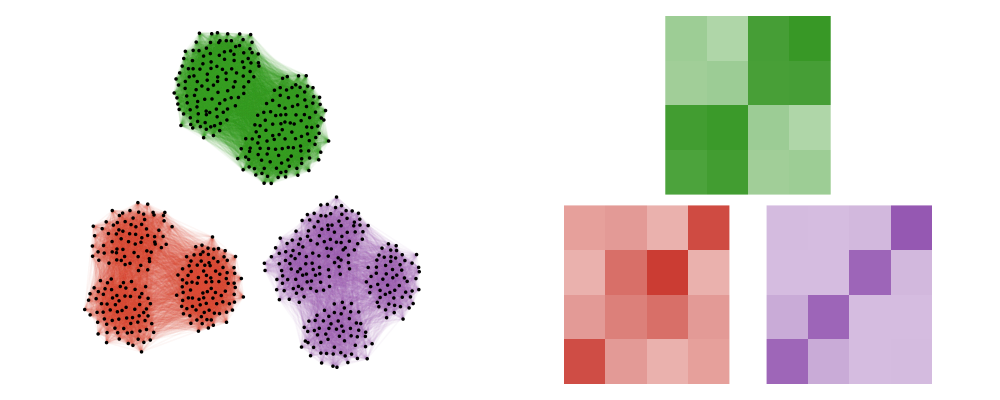

<picture>
  <source media="(prefers-color-scheme: dark)" srcset="./docs/src/assets/logo-dark.png">
  
</picture>

# NetworkHistogram

[](https://github.com/SciML/SciMLStyle)
[](https://codecov.io/gh/SDS-EPFL/NetworkHistogram.jl)
[](https://github.com/SDS-EPFL/NetworkHistogram.jl/actions/workflows/CI.yml)
[](https://sds-epfl.github.io/NetworkHistogram.jl/dev/)
[](https://sds-epfl.github.io/NetworkHistogram.jl/stable/)
[](https://zenodo.org/doi/10.5281/zenodo.10212851)

Implementation of the network histogram for graphon estimation from the paper
[Network histograms and universality of blockmodel approximation (2014)](https://doi.org/10.1073/pnas.1400374111)
by Sofia C. Olhede and Patrick J. Wolfe and its extension to decorated graphs
by Charles Dufour and Sofia C. Olhede
[Inference for decorated graphs and application to multiplex networks (2024)](https://arxiv.org/abs/2408.12339).

The network histogram is a nonparametric estimator for the generating mechanism
of an exchangeable random graph (see graphons, decorated graphons and
probability graphons). We assume our observed graph is
$A \in \mathcal{K}^{n \times n}$, where $\mathcal{K}$ is a set of edge
decorations (e.g. $\{0,1\}$ for unweighted graphs, $\mathbb{N}$ for count
edges, $\mathbb{R}$ for real-valued edges, etc.). Using the Aldous-Hoover
theorem, we know that $A$ is generated from a graphon
$W: [0,1]^2 \to \mathcal{P}\left(\mathcal{K}\right)$, where
$\mathcal{P}\left(\mathcal{K}\right)$ is the set of probability measures on
$\mathcal{K}$ in the following way:

1. Sample $U_1, \ldots, U_n \sim \text{iid } \text{Uniform}[0,1]$.
2. For each pair of nodes $i,j$, sample the edge $A_{ij} \sim W(U_i, U_j)$
   independently.

The network histogram approximates the generating graphon
$W: [0,1]^2 \to \mathcal{P}\left(\mathcal{K}\right)$ by a piecewise constant
function, i.e. a stochastic block model with $k$ blocks. For details, see the
papers mentioned above.

## Installation

```julia
Pkg.add("NetworkHistogram")
```

## Usage

### Basic Usage

We fit the estimator and then extract the estimated graphon matrix and node
labels.

```julia
using NetworkHistogram, LinearAlgebra

A = Symmetric(rand(0:1, 100, 100))
A[diagind(A)] .= 0

# approximate the graphon with a network histogram
hist = graphhist(A)

# get the graphhist structure
estimate = hist.graphhist

# get the estimated graphon matrix
sbm_matrix = estimate.θ

# get the estimated node labels
node_labels = estimate.node_labels
```

### Advanced Usage with Custom Parameters

You can control the optimization process by modifying the rules used in the
optimization:

```julia
using NetworkHistogram

# Binary network
A = Symmetric(rand(0:1, 100, 100))
A[diagind(A)] .= 0

# Initial partition into k groups
k = 3
initial_labels = rand(1:k, 100)

# Configure optimization parameters
params = GreedyParams(
    50_000,                      # Maximum iterations
    RandomNodeSwap(),             # How to select nodes to swap
    Strict(),                     # Only accept improvements
    PreviousBestValue(5000),     # Stop after 5000 iterations without improvement
    true                          # Show progress bar
)

# Fit the network histogram
result = nethist(A, Bernoulli(0.5), initial_labels, params)

# Extract results
ll = loglikelihood(result)
block_params = result.θ
node_groups = result.node_labels
```

### Working with Different Edge Types

The package supports various edge types through custom distributions:

```julia
using NetworkHistogram
using Distributions  # For standard distributions

# Example 1: Weighted networks with continuous edges
W = Symmetric(rand(100, 100))
W[diagind(W)] .= 0
# You can use any distribution that implements the required interface

# Example 2: Count data (e.g., number of interactions)
C = Symmetric(rand(Poisson(2), 100, 100))
C[diagind(C)] .= 0
# Use appropriate count distribution

# Example 3: Sparse networks with missing edges
A_sparse = Symmetric(rand([0, 1, missing], 100, 100))
A_sparse[diagind(A_sparse)] .= 0
# Missing values are treated as absent edges
```

### Visualizing Results (with Makie.jl)

```julia
using NetworkHistogram
using CairoMakie  # or GLMakie

# Fit model
A = Symmetric(rand(0:1, 100, 100))
A[diagind(A)] .= 0
result = nethist(A, Bernoulli(0.5), rand(1:3, 100), GreedyParams())

# Create heatmap of estimated parameters
fig = heatmap_params(result, ordering=true, colormap=:viridis)
save("network_histogram.png", fig)
```

### Sampling from a Block Model

```julia
using NetworkHistogram

# Define a 3-block model
k = 3
bm = BlockModel(k, Bernoulli(0.5))

# Set custom edge probabilities between blocks
bm[1, 1] = Bernoulli(0.8)  # High within-group connectivity
bm[2, 2] = Bernoulli(0.7)
bm[3, 3] = Bernoulli(0.6)
bm[1, 2] = Bernoulli(0.1)  # Low between-group connectivity
bm[1, 3] = Bernoulli(0.05)
bm[2, 3] = Bernoulli(0.05)

# Sample a network
n_nodes = 150
latents, A = sample(bm, n_nodes)

# latents contains the true block assignments
# A is the sampled adjacency matrix
```

Check out the
[documentation](https://sds-epfl.github.io/NetworkHistogram.jl/dev/) for more
examples and detailed API information.
